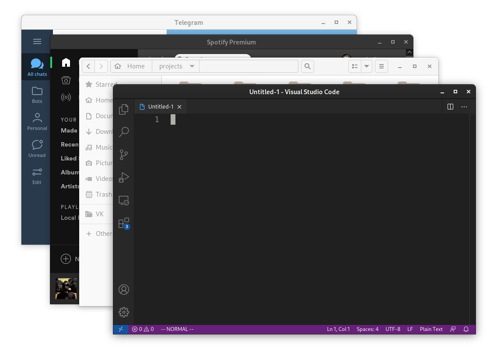

# Dark headers
Set dark window headers on a per-application basis.



In GNOME, you can set a dark theme only for a GTK application using the `GTK_THEME` environment variable. If you do this for applications written in Electron, Qt, and other tools, the app's headerbar will not change to dark. My script fixed this problem.

Just create a configuration file `~/.config/dark-headers.conf` and run the script. In the config, enter WM_CLASS of the apps you need. Example:
```gtk-dark.conf
code
jetbrains
spotify
keeweb
atom
```
# Dependencies
`xorg-xprop`

# License
MIT
